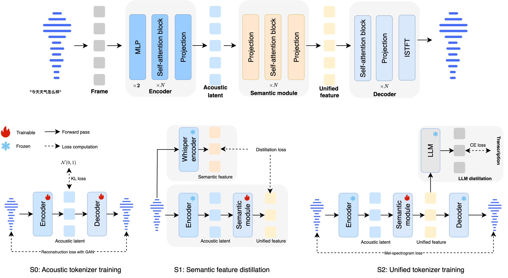

<p align="center">
    
<p>

<p align="center">📑 <a href="https://github.com/inclusionAI/Ming-UniAudio/blob/main/assets/Ming_UniAudio.pdf">Technical Report</a>｜📖<a href="https://xqacmer.github.io/Ming-Unitok-Audio.github.io">Project Page</a> ｜🤗 <a href="https://huggingface.co/inclusionAI/Ming-UniAudio-Tokenizer">Hugging Face</a>｜ 🤖 <a href="https://modelscope.cn/models/inclusionAI/Ming-UniAudio-Tokenizer">ModelScope</a>

## Architecture
<!-- 
 -->

<p align="center">
  
</p>
<p align="center">
  
</p>

## Key Features
- 🚀 **Unified Representation:** A single semantic-acoustic unified representation for both understanding and generation tasks.
- 🎧 **High-Fidelity Reconstruction:** Achieve high-fidelity audio generation by modeling continuous features with a VAE, minimizing information loss and preserving intricate acoustic textures.
- 🌐 **Convolution-Free Efficiency:** Built on a pure causal transformer architecture, completely eliminating convolutional layers for superior efficiency and a simpler design.


## Installation
```
pip install -r requirements.txt
```

## Quick start
```python
import torch
import torchaudio

from audio_tokenizer.modeling_audio_vae import AudioVAE

model = AudioVAE.from_pretrained('inclusionAI/Ming-UniAudio-Tokenizer')
model = model.cuda()
model.eval()

waveform, sr = torchaudio.load('data/1089-134686-0000.flac', backend='soundfile')
sample = {'waveform': waveform.cuda(), 'waveform_length': torch.tensor([waveform.size(-1)]).cuda()}

with torch.no_grad():
    with torch.autocast(device_type='cuda', dtype=torch.bfloat16):
        latent, frame_num = model.encode_latent(**sample)
        output_waveform = model.decode(latent)

torchaudio.save('./1089-134686-0000_reconstruct.wav', output_waveform.cpu()[0], sample_rate=16000)
```

## Performance
### Speech reconstruction performance 
| System                          | FrameRate | PESQ↑ (SEED-ZH) | SIM↑ (SEED-ZH) | STOI↑ (SEED-ZH) | PESQ↑ (SEED-EN) | SIM↑ (SEED-EN) | STOI↑ (SEED-EN) |
|---------------------------------|-----------|-----------------|----------------|-----------------|-----------------|----------------|-----------------|
| **Ming-UniAudio-Tokenizer (ours)**  | **50**    | **4.21**        | **0.96**       | **0.98**        | **4.04**        | **0.96**       | **0.98**        |
| MiMo-Audio-Tokenizer | 25        | 2.71            | 0.89           | 0.93            | 2.43            | 0.85           | 0.92            |
| GLM4-Voice-Tokenizer | 12.5      | 1.06            | 0.33           | 0.61            | 1.05            | 0.12           | 0.60            |
| Baichuan-Audio-Tokenizer | 12.5  | 1.84            | 0.78           | 0.86            | 1.62            | 0.69           | 0.85            |
| XY-Tokenizer         | 12.5      | 2.27            | 0.77           | 0.90            | 2.14            | 0.82           | 0.90            |
| Mimi                 | 75        | 2.05            | 0.73           | 0.89            | 2.01            | 0.77           | 0.89            |
| XCodec2.0            | 50        | 2.19            | 0.80           | 0.92            | 2.37            | 0.82           | 0.93            |
| BigCodec             | 80        | 2.26            | 0.81           | 0.92            | 2.22            | 0.80           | 0.91            |

### The adaptation performance for downstream ASR/TTS tasks 
|                     | Und WER(%) ↓ |           |           |           |           |           |      | Gen WER(%) ↓/SIM↑ |           |           |
|---------------------|--------------|-----------|-----------|-----------|-----------|-----------|------|-------------------|-----------|-----------|
| **Stage**           | aishell1     | aishell2-ios | Fleurs-zh | LS-clean  | LS-other  | Voxpopuli-en | AVG  | Seed-zh         | Seed-en   | AVG       |
| Full fine-tuning    | 1.56         | 2.85      | 3.67      | 1.61      | 4.16      | 6.41      | 3.38 | 1.30/0.68      | 1.88/0.57 | 1.59/0.63 |


### The adaptation performance for downstream Audio-Edit tasks

| **Task Types** | **Deletion** |           |             |       | **Insertion** |           |             |       | **Substitution** |           |             |       |
|----------------|:------------:|:---------:|:-----------:|:-----:|:-------------:|:---------:|:-----------:|:-----:|:----------------:|:---------:|:-----------:|:-----:|
|                | WER          | ACC       | No-Edit WER | SIM   | WER           | ACC       | No-Edit WER | SIM   | WER              | ACC       | No-Edit WER | SIM   |
| **Proposed**   | 12.52%       | 100%      | 12.05%      | 0.762 | 3.13%         | 84.71%    | 5.41%       | 0.814 | 4.90%            | 64.78%    | 5.20%       | 0.807 |

## Acknowledgements
1. We borrowed a lot of code from [X-Codec-2.0](https://github.com/zhenye234/X-Codec-2.0.git) for tokenizer training.
2. We thank the OpenAI team for developing the [Whisper](https://github.com/openai/whisper) model and making its weights publicly available.


## License and Legal Disclaimer

This code repository is licensed under the [MIT License](./LICENSE), and the Legal Disclaimer is located in the [LEGAL.md file](./LEGAL.md) under the project's root directory.

## Citation

If you find our work helpful, feel free to give us a cite.
